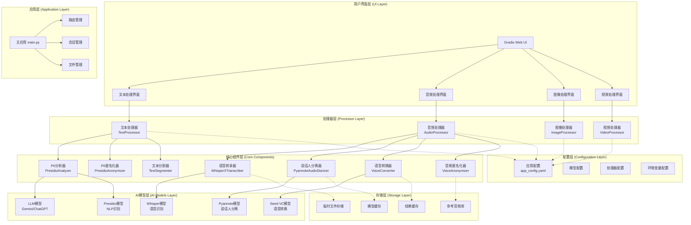
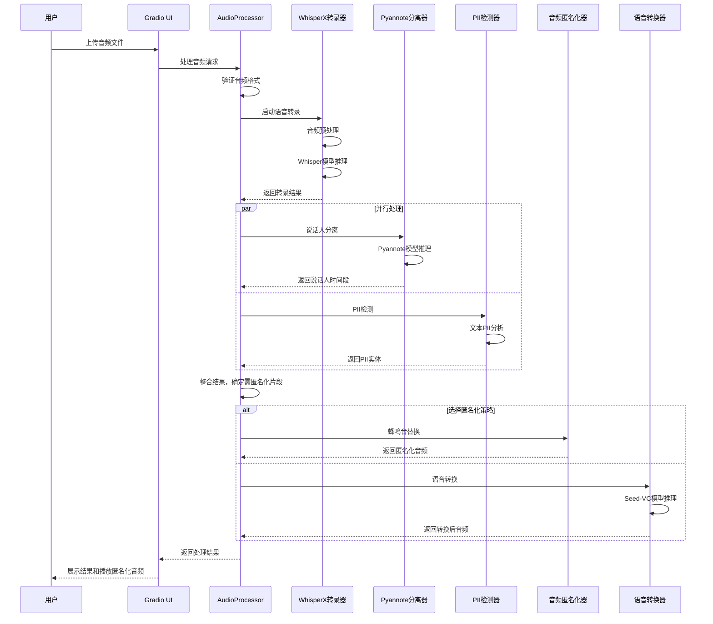
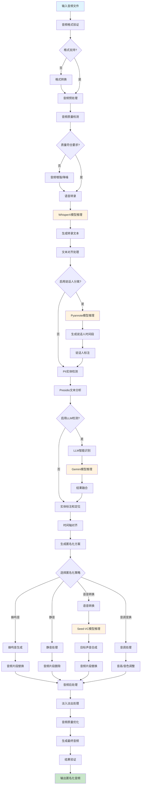
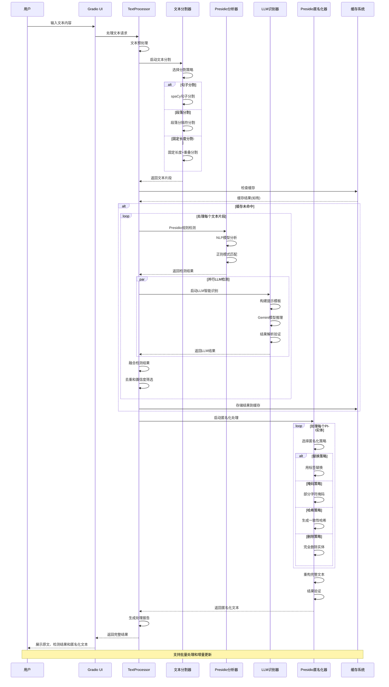
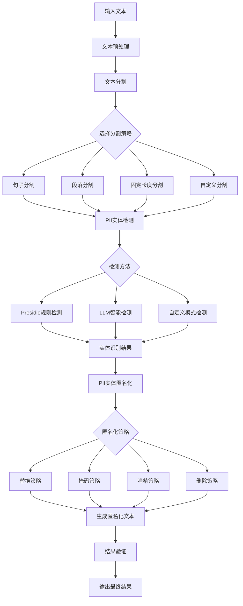

# ALL PII IN ONE - 综合个人身份信息处理系统

[](https://www.python.org/downloads/)
[](LICENSE)
[](https://gradio.app/)

一个强大的全方位个人身份信息（PII）检测、分析和匿名化处理系统。支持文本、音频、图像和视频多种媒体类型的PII处理，提供直观的Web界面和灵活的配置选项。

## 🌟 主要特性

### 🎯 多模态PII处理
- **文本处理**: 基于 Presidio 的高精度 PII 检测和匿名化
- **音频处理**: 语音转录、说话人分离、语音匿名化和转换
- **图像处理**: 面部识别和图像匿名化（开发中）
- **视频处理**: 综合视频内容的PII处理（开发中）

### 🤖 AI驱动的智能识别
- **LLM集成**: 支持 Gemini 等大语言模型进行智能PII识别
- **多语言支持**: 中文、英文等多语言PII检测
- **自定义规则**: 灵活的模式识别和自定义实体配置

### 🎙️ 专业音频处理
- **高质量转录**: 基于 WhisperX 的准确语音识别
- **说话人分离**: 自动识别和分离不同说话人
- **语音转换**: 基于 Seed-VC 的高质量语音转换
- **音频匿名化**: 多种匿名化策略（蜂鸣音、静音、语音转换）

### 🔧 高度可配置
- **分层配置系统**: YAML 配置文件支持灵活参数调整
- **模块化架构**: 独立的处理器模块便于扩展和维护
- **性能优化**: 支持 GPU 加速和批处理

## 📋 目录

- [系统架构](#系统架构)
- [安装说明](#安装说明)
- [快速开始](#快速开始)
- [配置说明](#配置说明)
- [使用指南](#使用指南)
- [API文档](#api文档)
- [开发指南](#开发指南)
- [常见问题](#常见问题)
- [贡献指南](#贡献指南)

## 🏗️ 系统架构

### 整体架构图



### 音频处理序列图



### 音频处理流程图



### 文本处理序列图



### 文本处理流程图



## 🚀 安装说明

### 系统要求

- Python 3.8+
- CUDA 11.8+ (推荐，用于GPU加速)
- 内存: 8GB+ (推荐16GB+)
- 存储空间: 10GB+ (用于模型缓存)

### 环境准备

1. **克隆项目**
```bash
git clone https://github.com/your-username/all-pii-in-one.git
cd all-pii-in-one
```

2. **创建虚拟环境**
```bash
python -m venv venv
source venv/bin/activate  # Linux/Mac
# 或
venv\Scripts\activate  # Windows
```

3. **安装依赖**
```bash
pip install -r requirements.txt
```

### 模型下载

系统会在首次运行时自动下载所需模型，包括：

- **Whisper模型**: 语音识别模型
- **Pyannote模型**: 说话人分离模型  
- **Seed-VC模型**: 语音转换模型
- **Presidio模型**: NLP实体识别模型

### 配置API密钥

设置环境变量：

```bash
# Hugging Face Token (用于访问Pyannote模型)
export HF_TOKEN="your_huggingface_token"

# Google Gemini API Key (用于LLM识别)
export GEMINI_API_KEY="your_gemini_api_key"

# OpenAI API Key (可选)
export OPENAI_API_KEY="your_openai_api_key"
```

## 🎮 快速开始

### 启动Web界面

```bash
python src/app/main.py
```

访问 `http://localhost:7860` 开始使用。

### 基本使用流程

1. **选择处理类型**: 文本、音频、图像或视频
2. **上传文件**: 拖拽或点击上传目标文件
3. **配置参数**: 根据需要调整处理参数
4. **开始处理**: 点击处理按钮启动分析
5. **查看结果**: 查看检测到的PII实体和匿名化结果
6. **下载文件**: 下载处理后的匿名化文件

### 命令行使用

```python
from src.processors.text_processor import TextProcessor
from src.configs import AppConfig

# 初始化
config = AppConfig.from_yaml_file("config/app_config.yaml")
processor = TextProcessor(config.processor.text_processor)

# 处理文本
text = "我的姓名是张三，电话号码是13812345678"
result = processor.process(text)

print(f"原文: {result.original_text}")
print(f"匿名化结果: {result.anonymized_text}")
```

## ⚙️ 配置说明

### 主配置文件

配置文件位于 `config/app_config.yaml`，包含以下主要部分：

#### 通用配置
```yaml
general:
  log_level: "INFO"
  temp_file_dir: "/tmp/pii_app"
  device: "cpu"  # 或 "cuda"
  ui:
    theme: "default"
    server_port: 7860
```

#### 文本处理器配置
```yaml
processor:
  text_processor:
    supported_entities:
      - PERSON
      - PHONE_NUMBER
      - EMAIL_ADDRESS
      - ID_CARD
    analyzer:
      presidio_enabled: true
      supported_languages: ["zh", "en"]
      enable_llm_recognizers: true
```

#### 音频处理器配置
```yaml
processor:
  audio_processor:
    transcription:
      model_size: "base"
      language: null  # 自动检测
    diarization:
      enabled: true
      min_speakers: 1
      max_speakers: 5
```

### 自定义配置

您可以通过以下方式自定义配置：

1. **修改配置文件**: 直接编辑 `config/app_config.yaml`
2. **环境变量覆盖**: 使用环境变量覆盖特定配置
3. **代码配置**: 在代码中动态设置配置参数

## 📚 使用指南

### 文本处理

#### 支持的PII实体类型

| 实体类型 | 描述 | 示例 |
|---------|------|------|
| PERSON | 人名 | 张三, 李四 |
| PHONE_NUMBER | 电话号码 | 13812345678 |
| EMAIL_ADDRESS | 邮箱地址 | user@example.com |
| ID_CARD | 身份证号 | 110101199001011234 |
| BANK_CARD | 银行卡号 | 6212261234567890123 |
| ADDRESS | 地址信息 | 北京市朝阳区xxx街道 |
| DATE_TIME | 日期时间 | 2024-01-01 |

#### 匿名化策略

1. **替换策略**: 用预定义标签替换
   - `张三` → `[PERSON]`
   - `13812345678` → `[PHONE]`

2. **掩码策略**: 部分字符掩码
   - `13812345678` → `138****5678`
   - `user@example.com` → `u***@example.com`

3. **哈希策略**: 生成一致性哈希
   - `张三` → `person_abc123`

### 音频处理

#### 支持的音频格式

- WAV (推荐)
- MP3
- FLAC
- OGG

#### 处理功能

1. **语音转录**: 将音频转换为文本
2. **说话人分离**: 识别不同说话人的时间段
3. **PII检测**: 在转录文本中检测PII实体
4. **音频匿名化**: 
   - 蜂鸣音替换
   - 静音处理
   - 语音转换

#### 最佳实践

- **音频质量**: 推荐使用采样率22050Hz或以上的音频
- **文件大小**: 支持大文件，但建议分段处理超长音频
- **语言设置**: 指定语言可提高转录准确性

## 🔧 API文档

### 文本处理API

```python
class TextProcessor:
    def process(self, text: str, 
                entities: List[str] = None,
                anonymization_strategy: str = "replace") -> ProcessingResult:
        """
        处理文本中的PII实体
        
        参数:
            text: 输入文本
            entities: 要检测的实体类型列表
            anonymization_strategy: 匿名化策略
            
        返回:
            ProcessingResult: 处理结果
        """
```

### 音频处理API

```python
class AudioProcessor:
    def process_audio(self, audio_path: str,
                     enable_diarization: bool = True,
                     enable_pii_detection: bool = True,
                     anonymization_method: str = "beep") -> AudioProcessingResult:
        """
        处理音频文件
        
        参数:
            audio_path: 音频文件路径
            enable_diarization: 是否启用说话人分离
            enable_pii_detection: 是否启用PII检测
            anonymization_method: 匿名化方法
            
        返回:
            AudioProcessingResult: 处理结果
        """
```

## 🛠️ 开发指南

### 项目结构

```
all-pii-in-one/
├── config/                 # 配置文件
│   ├── app_config.yaml     # 主配置文件
│   └── prompt_template.yaml # LLM提示模板
├── src/
│   ├── app/                # 应用层
│   │   ├── main.py         # 主应用入口
│   │   └── tabs/           # UI标签页
│   ├── processors/         # 处理器层
│   │   ├── text_processor/ # 文本处理器
│   │   ├── audio_processor/# 音频处理器
│   │   ├── image_processor/# 图像处理器
│   │   └── video_processor/# 视频处理器
│   ├── configs/            # 配置类
│   ├── commons/            # 公共工具
│   └── modules/            # 第三方模块
├── test/                   # 测试文件
├── data/                   # 数据文件
└── requirements.txt        # 依赖清单
```

### 添加新的处理器

1. **创建处理器类**
```python
from src.processors.base_processor import BaseProcessor

class CustomProcessor(BaseProcessor):
    def process(self, input_data):
        # 实现处理逻辑
        pass
```

2. **添加配置**
```yaml
processor:
  custom_processor:
    param1: value1
    param2: value2
```

3. **集成到UI**
```python
def create_custom_tab():
    with gr.TabItem("自定义处理"):
        # 创建UI组件
        pass
```

### 扩展PII实体类型

1. **添加识别规则**
```python
from presidio_analyzer import Pattern, PatternRecognizer

class CustomRecognizer(PatternRecognizer):
    PATTERNS = [
        Pattern("CUSTOM_ENTITY", r"regex_pattern", 0.8)
    ]
```

2. **配置匿名化策略**
```yaml
text_processor:
  anonymizer:
    entity_anonymization_config:
      CUSTOM_ENTITY:
        operator: "replace"
        params:
          new_value: "[CUSTOM]"
```

## ❓ 常见问题

### Q: 模型下载失败怎么办？

A: 检查网络连接，确保有足够的存储空间。某些模型需要Hugging Face token。

### Q: GPU内存不足怎么处理？

A: 在配置文件中设置 `device: "cpu"` 或减小 `batch_size`。

### Q: 支持哪些语言？

A: 目前主要支持中文和英文，可通过配置文件扩展其他语言。

### Q: 如何提高处理速度？

A: 
- 使用GPU加速
- 增加batch_size
- 启用缓存功能
- 使用更小的模型

### Q: 匿名化结果不准确怎么办？

A: 
- 调整实体检测阈值
- 添加自定义识别规则
- 使用LLM识别器
- 检查语言设置

## 🤝 贡献指南

我们欢迎社区贡献！请遵循以下步骤：

1. **Fork项目**
2. **创建特性分支**
```bash
git checkout -b feature/your-feature-name
```

3. **提交更改**
```bash
git commit -m "Add your feature"
```

4. **推送分支**
```bash
git push origin feature/your-feature-name
```

5. **创建Pull Request**

### 贡献类型

- 🐛 Bug修复
- ✨ 新功能
- 📚 文档改进
- 🎨 UI/UX改进
- ⚡ 性能优化
- 🧪 测试用例

### 代码规范

- 遵循PEP 8编码规范
- 添加适当的注释和文档字符串
- 编写单元测试
- 更新相关文档

## 📄 许可证

本项目采用 MIT 许可证。详见 [LICENSE](LICENSE) 文件。

## 🙏 致谢

感谢以下开源项目的贡献：

- [Presidio](https://github.com/microsoft/presidio) - PII检测和匿名化
- [WhisperX](https://github.com/m-bain/whisperX) - 语音识别和对齐
- [Pyannote](https://github.com/pyannote/pyannote-audio) - 说话人分离
- [Seed-VC](https://github.com/Plachtaa/seed-vc) - 语音转换
- [Gradio](https://github.com/gradio-app/gradio) - Web界面框架

## 📞 联系我们

- 📧 邮箱: 
- 🐛 问题反馈: [GitHub Issues](https://github.com/your-username/all-pii-in-one/issues)
- 💬 讨论: [GitHub Discussions](https://github.com/your-username/all-pii-in-one/discussions)

---

<div align="center">

**如果这个项目对您有帮助，请给我们一个 ⭐ Star！**

Made with ❤️ by the ALL PII IN ONE Team

</div>