# 系统架构文档

本文档详细描述了 ALL PII IN ONE 系统的技术架构、设计模式和实现细节。

## 目录

- [架构概览](#架构概览)
- [核心设计原则](#核心设计原则)
- [模块详细设计](#模块详细设计)
- [数据流分析](#数据流分析)
- [性能优化策略](#性能优化策略)
- [扩展指南](#扩展指南)

## 架构概览

### 分层架构设计

系统采用经典的分层架构模式，从上到下分为：

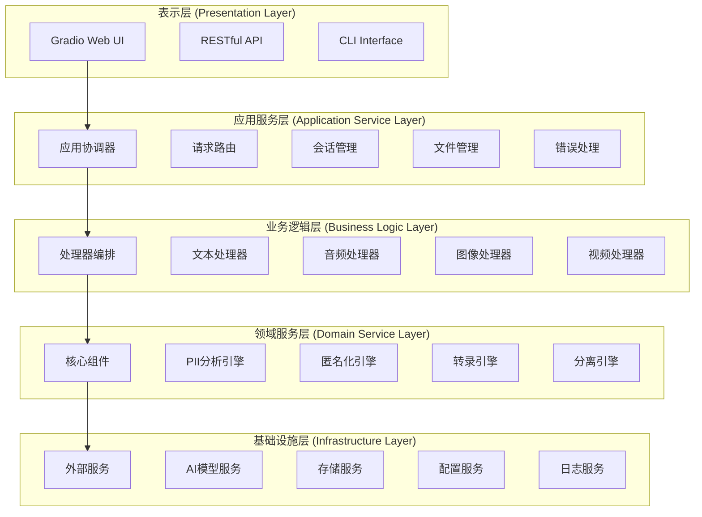

### 模块依赖关系图

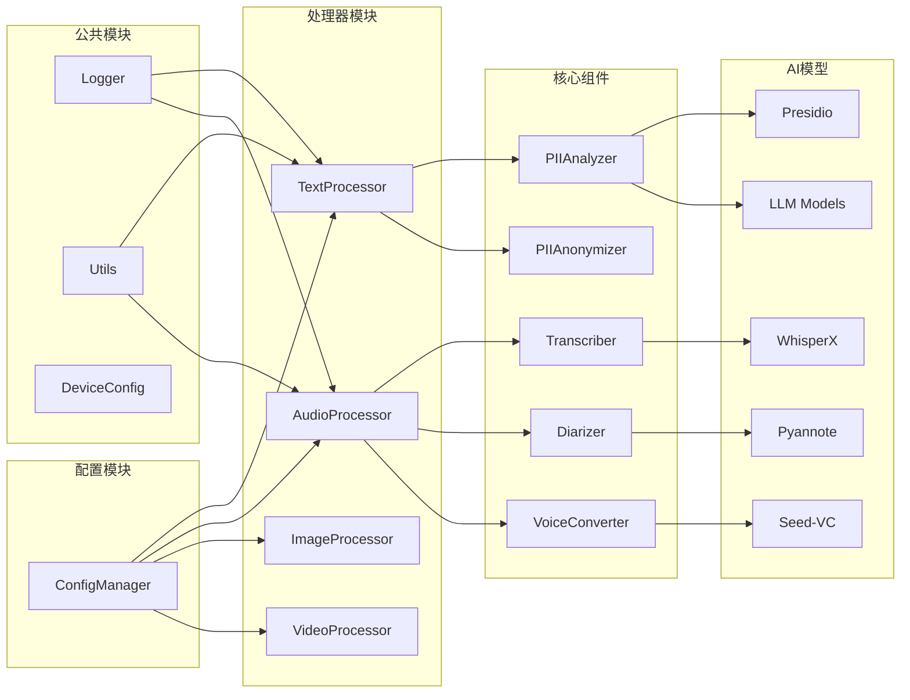

## 核心设计原则

### 1. 单一职责原则 (SRP)

每个模块都有明确的职责：

- **TextProcessor**: 专注于文本PII处理
- **AudioProcessor**: 专注于音频PII处理
- **ConfigManager**: 专注于配置管理
- **Logger**: 专注于日志记录

### 2. 开闭原则 (OCP)

系统对扩展开放，对修改封闭：

```python
# 抽象基类定义接口
class BaseProcessor:
    def process(self, input_data: Any) -> ProcessingResult:
        raise NotImplementedError

# 具体实现可以扩展而不修改基类
class TextProcessor(BaseProcessor):
    def process(self, text: str) -> ProcessingResult:
        # 文本处理实现
        pass

class AudioProcessor(BaseProcessor):
    def process(self, audio_data: bytes) -> ProcessingResult:
        # 音频处理实现
        pass
```

### 3. 依赖注入原则 (DIP)

高层模块不依赖低层模块，都依赖抽象：

```python
class AudioProcessor:
    def __init__(self, 
                 transcriber: AbstractTranscriber,
                 diarizer: AbstractDiarizer,
                 anonymizer: AbstractAnonymizer):
        self.transcriber = transcriber
        self.diarizer = diarizer
        self.anonymizer = anonymizer
```

### 4. 组合优于继承

使用组合来构建复杂功能：

```python
class AudioProcessor:
    def __init__(self, config: AudioProcessorConfig):
        self.transcription_component = TranscriptionComponent(config.transcription)
        self.diarization_component = DiarizationComponent(config.diarization)
        self.pii_detection_component = PIIDetectionComponent(config.pii_detection)
        self.anonymization_component = AnonymizationComponent(config.anonymization)
```

## 模块详细设计

### 配置系统设计

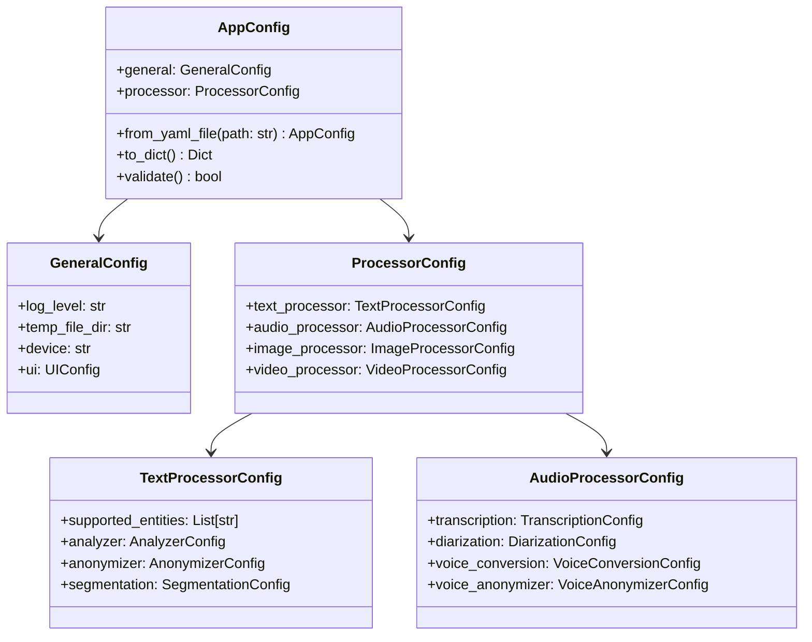

#### 配置加载流程

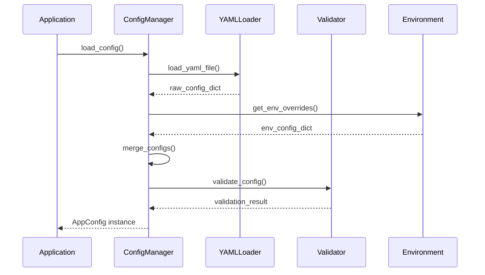

### 文本处理器设计

#### 核心组件交互

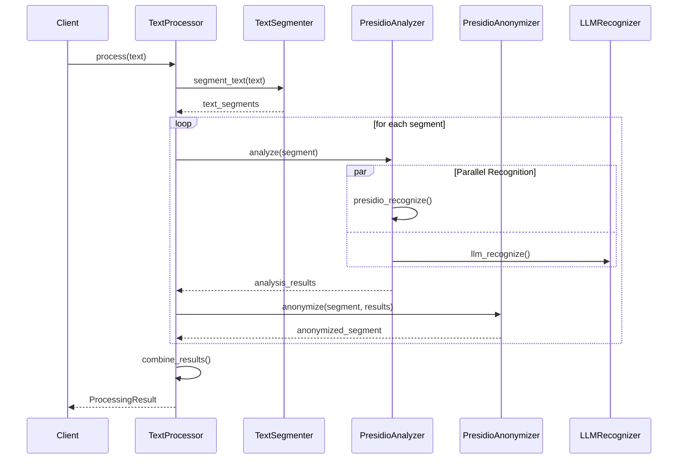

#### 实体识别架构

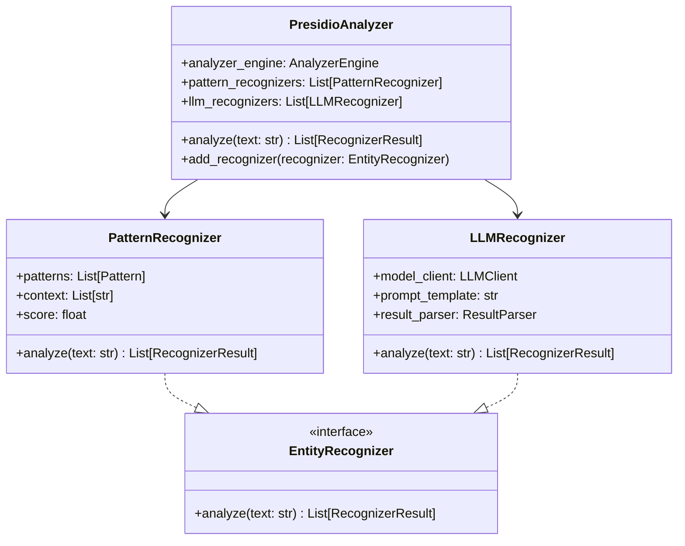

### 音频处理器设计

#### 音频处理管道

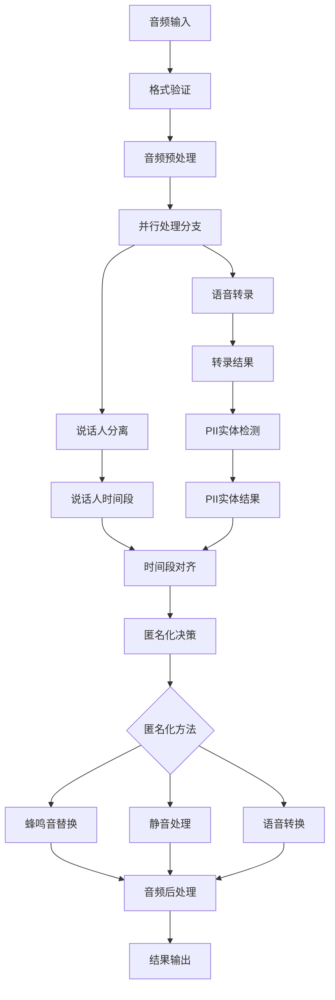

#### 语音转录组件设计

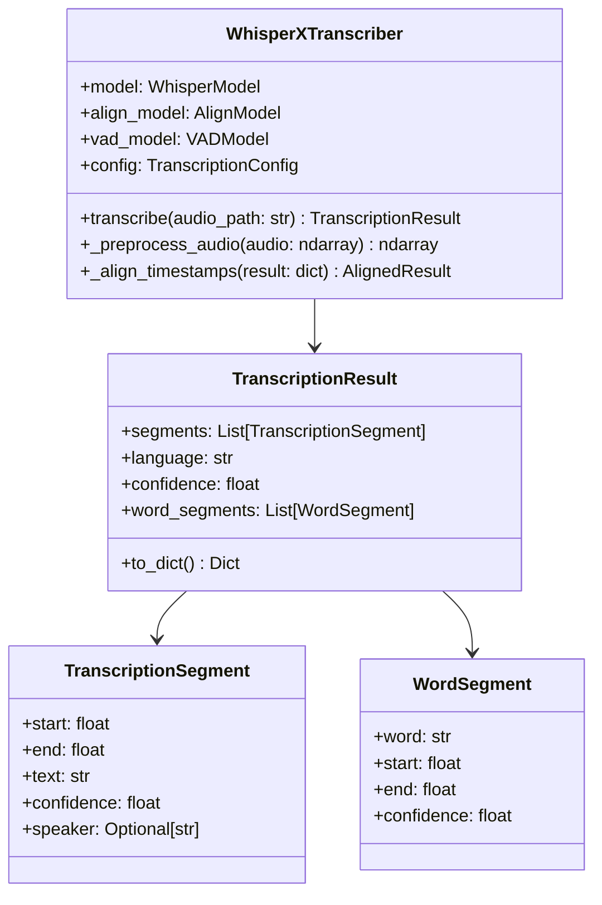

#### 说话人分离组件设计

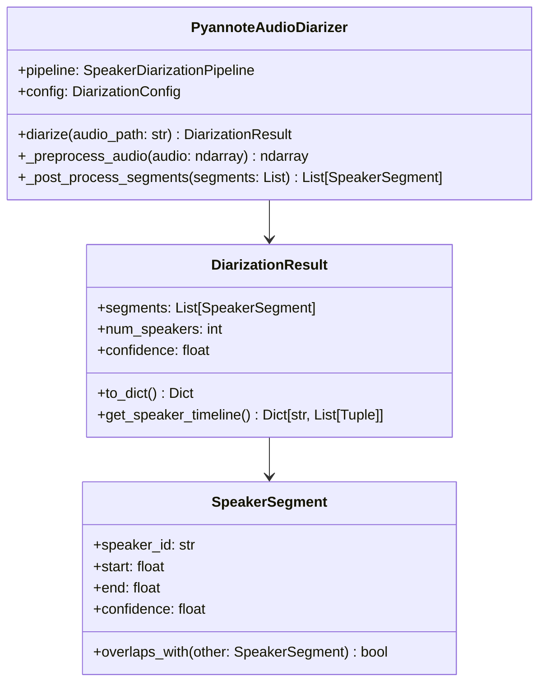

## 数据流分析

### 音频处理数据流

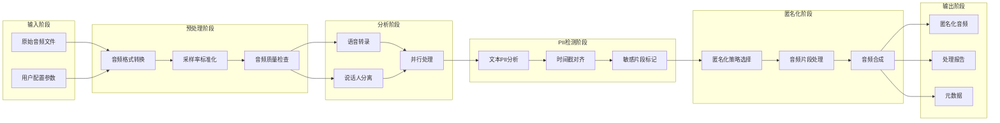

### 文本处理数据流

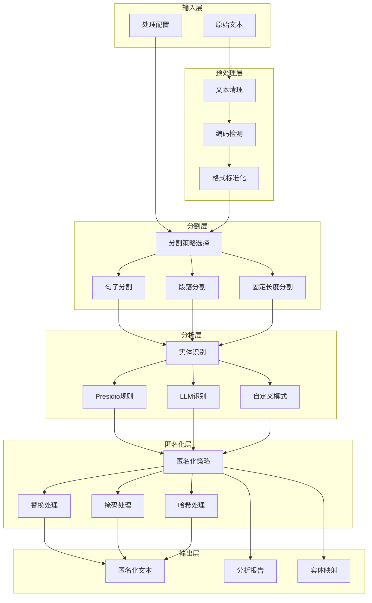

## 性能优化策略

### 1. 内存管理优化

#### 音频处理内存优化

```python
class MemoryOptimizedAudioProcessor:
    def __init__(self, config):
        self.chunk_size = config.chunk_size
        self.overlap_size = config.overlap_size
        
    def process_large_audio(self, audio_path: str):
        # 分块处理大文件
        for chunk in self._iter_audio_chunks(audio_path):
            result = self._process_chunk(chunk)
            yield result
            
    def _iter_audio_chunks(self, audio_path: str):
        # 使用生成器避免全部加载到内存
        with AudioFile(audio_path) as f:
            while True:
                chunk = f.read(self.chunk_size)
                if not chunk:
                    break
                yield chunk
```

#### 文本处理内存优化

```python
class MemoryOptimizedTextProcessor:
    def process_large_text(self, text: str):
        # 流式处理
        for segment in self._segment_text_stream(text):
            result = self._process_segment(segment)
            yield result
            
    def _segment_text_stream(self, text: str):
        # 边读边处理，不存储全部内容
        buffer = ""
        for line in text.splitlines():
            buffer += line + "\n"
            if len(buffer) > self.buffer_size:
                yield buffer
                buffer = ""
        if buffer:
            yield buffer
```

### 2. 并行处理优化

#### 多进程音频处理

```python
from concurrent.futures import ProcessPoolExecutor, as_completed
import multiprocessing as mp

class ParallelAudioProcessor:
    def __init__(self, config):
        self.max_workers = min(config.max_workers, mp.cpu_count())
        
    def process_multiple_files(self, audio_files: List[str]):
        with ProcessPoolExecutor(max_workers=self.max_workers) as executor:
            futures = {
                executor.submit(self._process_single_file, file): file 
                for file in audio_files
            }
            
            for future in as_completed(futures):
                file_path = futures[future]
                try:
                    result = future.result()
                    yield file_path, result
                except Exception as e:
                    yield file_path, None
```

#### GPU加速优化

```python
class GPUOptimizedProcessor:
    def __init__(self, config):
        self.device = self._setup_device(config)
        self.model_cache = {}
        
    def _setup_device(self, config):
        if config.device == "auto":
            return "cuda" if torch.cuda.is_available() else "cpu"
        return config.device
        
    def _load_model_with_cache(self, model_name: str):
        if model_name not in self.model_cache:
            model = self._load_model(model_name)
            model.to(self.device)
            self.model_cache[model_name] = model
        return self.model_cache[model_name]
```

### 3. 缓存策略

#### 多级缓存系统

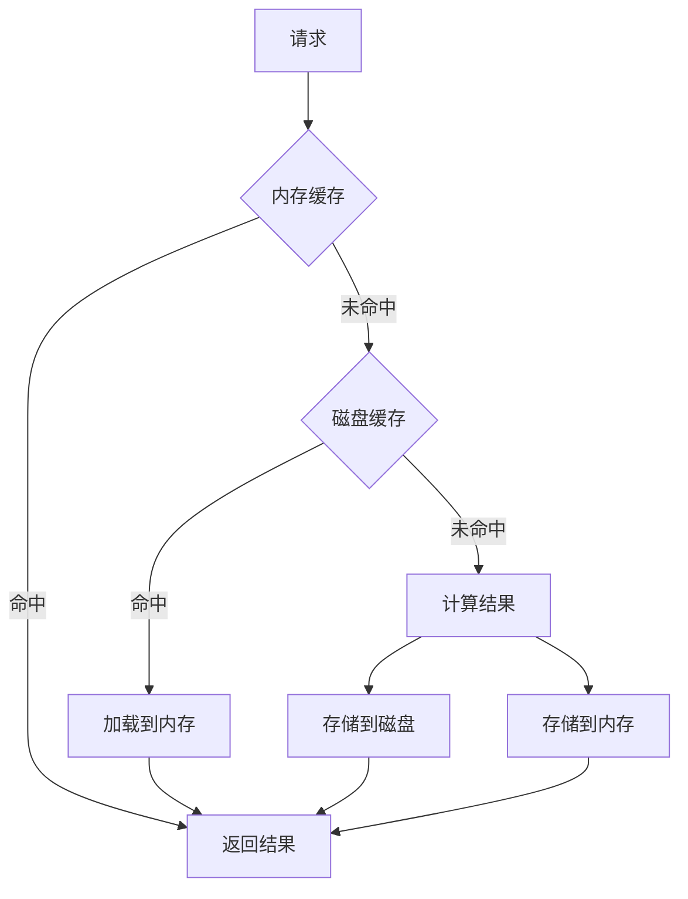

#### 实现示例

```python
class MultiLevelCache:
    def __init__(self, memory_size: int, disk_cache_dir: str):
        self.memory_cache = LRUCache(memory_size)
        self.disk_cache_dir = Path(disk_cache_dir)
        self.disk_cache_dir.mkdir(exist_ok=True)
        
    def get(self, key: str):
        # 先查内存缓存
        if key in self.memory_cache:
            return self.memory_cache[key]
            
        # 再查磁盘缓存
        disk_path = self.disk_cache_dir / f"{key}.pkl"
        if disk_path.exists():
            with open(disk_path, 'rb') as f:
                value = pickle.load(f)
            self.memory_cache[key] = value
            return value
            
        return None
        
    def set(self, key: str, value: Any):
        # 存储到内存
        self.memory_cache[key] = value
        
        # 存储到磁盘
        disk_path = self.disk_cache_dir / f"{key}.pkl"
        with open(disk_path, 'wb') as f:
            pickle.dump(value, f)
```

## 扩展指南

### 添加新的PII实体类型

#### 1. 定义实体识别器

```python
from presidio_analyzer import Pattern, PatternRecognizer

class ChineseBankCardRecognizer(PatternRecognizer):
    """中国银行卡号识别器"""
    
    PATTERNS = [
        Pattern(
            "CHINESE_BANK_CARD",
            r"\b\d{16,19}\b",
            0.7
        )
    ]
    
    CONTEXT = ["银行卡", "卡号", "账号", "bank", "card"]
    
    def __init__(self):
        patterns = self.PATTERNS
        super().__init__(
            supported_entity="CHINESE_BANK_CARD",
            patterns=patterns,
            context=self.CONTEXT
        )
        
    def validate_result(self, pattern_text: str) -> bool:
        """验证识别结果"""
        # 实现银行卡号的校验逻辑
        return self._luhn_check(pattern_text)
        
    def _luhn_check(self, card_number: str) -> bool:
        """Luhn算法校验"""
        # 实现Luhn算法
        pass
```

#### 2. 配置匿名化策略

```yaml
text_processor:
  anonymizer:
    entity_anonymization_config:
      CHINESE_BANK_CARD:
        operator: "mask"
        params:
          masking_char: "*"
          chars_to_mask: 12
          from_end: false
```

#### 3. 注册识别器

```python
def register_custom_recognizers(analyzer: PresidioAnalyzer):
    """注册自定义识别器"""
    analyzer.add_recognizer(ChineseBankCardRecognizer())
```

### 添加新的处理器类型

#### 1. 创建基础处理器

```python
from abc import ABC, abstractmethod
from typing import Any, Dict, List
from dataclasses import dataclass

@dataclass
class ProcessingResult:
    """通用处理结果"""
    original_data: Any
    processed_data: Any
    metadata: Dict[str, Any]
    confidence: float

class BaseProcessor(ABC):
    """处理器基类"""
    
    def __init__(self, config: Dict[str, Any]):
        self.config = config
        self.logger = get_module_logger(self.__class__.__name__)
        
    @abstractmethod
    def process(self, input_data: Any) -> ProcessingResult:
        """处理输入数据"""
        pass
        
    @abstractmethod
    def validate_input(self, input_data: Any) -> bool:
        """验证输入数据"""
        pass
        
    def preprocess(self, input_data: Any) -> Any:
        """预处理"""
        return input_data
        
    def postprocess(self, result: ProcessingResult) -> ProcessingResult:
        """后处理"""
        return result
```

#### 2. 实现具体处理器

```python
class ImageProcessor(BaseProcessor):
    """图像处理器"""
    
    def __init__(self, config: ImageProcessorConfig):
        super().__init__(config.to_dict())
        self.face_detector = self._init_face_detector()
        self.anonymizer = self._init_anonymizer()
        
    def process(self, image_path: str) -> ProcessingResult:
        """处理图像"""
        # 验证输入
        if not self.validate_input(image_path):
            raise ValueError("Invalid image input")
            
        # 加载图像
        image = self._load_image(image_path)
        
        # 检测人脸
        faces = self.face_detector.detect(image)
        
        # 匿名化处理
        anonymized_image = self.anonymizer.anonymize(image, faces)
        
        # 构建结果
        result = ProcessingResult(
            original_data=image_path,
            processed_data=anonymized_image,
            metadata={
                "faces_detected": len(faces),
                "processing_time": time.time(),
            },
            confidence=self._calculate_confidence(faces)
        )
        
        return self.postprocess(result)
        
    def validate_input(self, image_path: str) -> bool:
        """验证图像输入"""
        if not isinstance(image_path, str):
            return False
        if not Path(image_path).exists():
            return False
        if not Path(image_path).suffix.lower() in ['.jpg', '.jpeg', '.png', '.bmp']:
            return False
        return True
```

#### 3. 集成到主应用

```python
def create_image_tab():
    """创建图像处理标签页"""
    with gr.TabItem("图像处理"):
        with gr.Row():
            with gr.Column():
                image_input = gr.Image(label="上传图像")
                process_btn = gr.Button("开始处理")
                
            with gr.Column():
                image_output = gr.Image(label="处理结果")
                result_text = gr.Textbox(label="检测结果")
                
        def process_image(image):
            processor = ImageProcessor(config.processor.image_processor)
            result = processor.process(image)
            return result.processed_data, str(result.metadata)
            
        process_btn.click(
            process_image,
            inputs=[image_input],
            outputs=[image_output, result_text]
        )
```