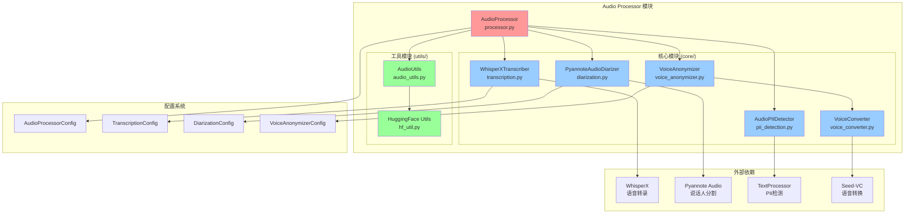
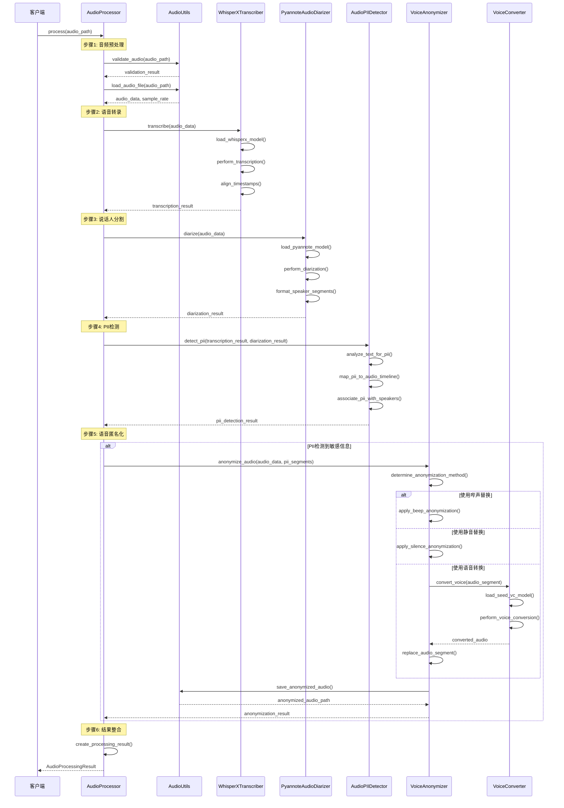
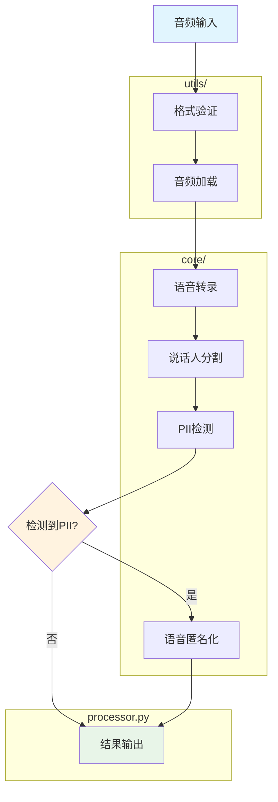
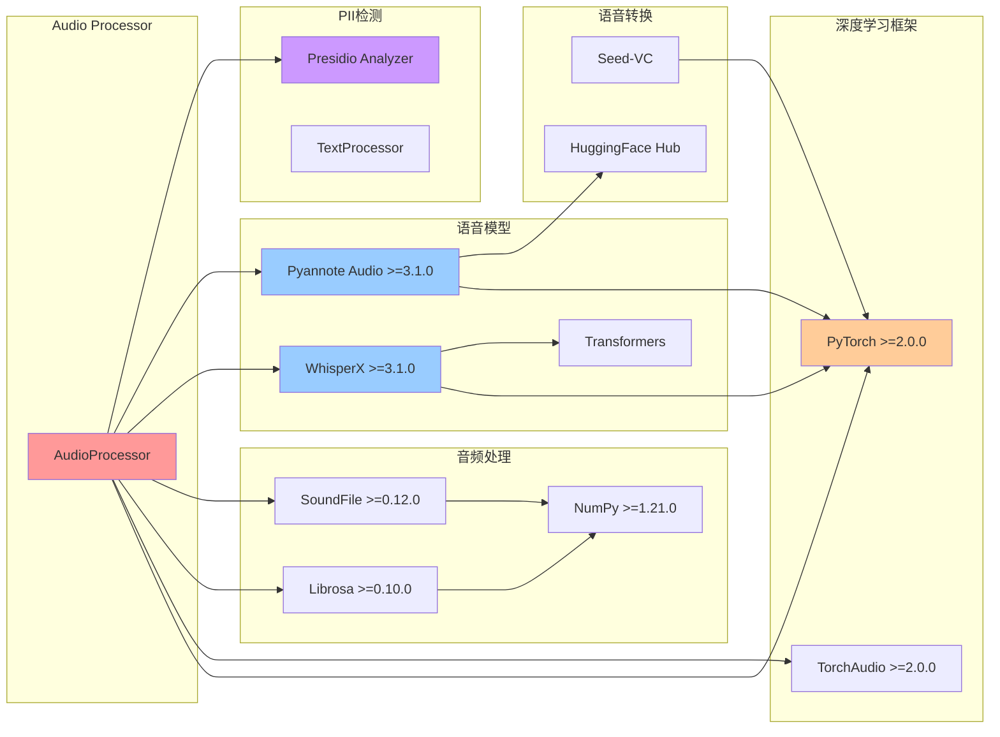

# Audio Processor 模块

## 简介

Audio Processor 是一个用于音频隐私信息处理的核心模块，专注于音频内容的PII（个人身份信息）检测和匿名化处理。该模块整合了先进的语音处理技术，包括基于WhisperX的语音转录、基于Pyannote Audio的说话人分割、PII检测和多种语音匿名化策略，为音频内容提供全面的隐私保护解决方案。

## 核心功能

- **语音转录**: 基于WhisperX的高精度语音识别，支持词级时间戳对齐
- **说话人分割**: 基于Pyannote Audio的说话人身份识别和时间分割
- **PII检测**: 结合text_processor的音频转录文本PII检测
- **语音匿名化**: 多种匿名化策略，包括静音替换、哔声替换和语音转换

## 目录结构

```
audio_processor/
│
├── __init__.py                 # 模块初始化，导出主要类和接口
├── processor.py                # 主处理器类，整合所有音频处理功能
│
├── core/                       # 核心功能模块
│   ├── __init__.py            # 核心模块导出
│   ├── transcription.py       # 语音转录模块（WhisperX）
│   ├── diarization.py         # 说话人分割模块（Pyannote Audio）
│   ├── pii_detection.py       # 音频PII检测模块
│   ├── voice_converter.py     # 语音转换器（基于Seed-VC）
│   └── voice_anonymizer.py    # 语音匿名化器（多策略）
│
└── utils/                      # 工具函数
    ├── __init__.py
    ├── audio_utils.py          # 音频处理工具函数
    └── hf_util.py             # HuggingFace模型工具
```

### 模块架构图



## 主要组件

### 1. AudioProcessor (processor.py)

主处理器类，提供统一的音频处理接口。

**主要功能：**
- 完整的音频PII检测和匿名化流程
- 模块化组件管理（转录、分割、检测、匿名化）
- 配置驱动的处理选项
- 错误处理和日志记录

**核心方法：**
```python
def process(
    audio_path: Union[str, Path],
    output_dir: Optional[Union[str, Path]] = None,
    **kwargs
) -> AudioProcessingResult
```

### 2. 核心功能模块 (core/)

#### WhisperXTranscriber (transcription.py)
- 基于WhisperX的语音转录
- 支持多种模型大小和语言
- 词级时间戳对齐
- 批处理优化

#### PyannoteAudioDiarizer (diarization.py)
- 基于Pyannote Audio的说话人分割
- 自动说话人数量检测
- 重叠语音处理
- 时间线生成和分析

#### AudioPIIDetector (pii_detection.py)
- 结合text_processor的PII检测
- 转录文本与音频时间戳映射
- 说话人关联的PII分析
- 多种实体类型支持

#### VoiceConverter (voice_converter.py)
- 基于Seed-VC的语音转换
- 零样本语音克隆
- 高质量音频生成

#### VoiceAnonymizer (voice_anonymizer.py)
- 多种匿名化策略
- 静音替换、哔声替换
- 配置化的匿名化方法

### 3. 工具模块 (utils/)

#### AudioUtils (audio_utils.py)
- 音频文件加载和验证
- 格式转换和预处理
- 音频分割和合并
- 静音检测和处理

## 数据结构

### AudioProcessingResult
```python
@dataclass
class AudioProcessingResult:
    original_audio_path: str                        # 原始音频路径
    transcription_result: AlignedTranscriptionResult # 转录结果
    diarization_result: Optional[DiarizationResult]  # 说话人分割结果
    pii_detection_result: Optional[AudioPIIResult]   # PII检测结果
    anonymized_audio_path: Optional[str]             # 匿名化音频路径
```

### PIIEntity
```python
@dataclass
class PIIEntity:
    entity_type: str           # PII实体类型
    text: str                 # 实体文本
    confidence: float         # 置信度
    start_time: Optional[float] # 音频开始时间
    end_time: Optional[float]   # 音频结束时间
    speaker_id: Optional[str]   # 关联的说话人ID
```

### SpeakerSegment
```python
@dataclass
class SpeakerSegment:
    speaker_id: str    # 说话人标识
    start_time: float  # 开始时间
    end_time: float    # 结束时间
```

## 使用方法

### 基础使用

```python
from src.processors.audio_processor import AudioProcessor
from src.configs import AppConfig

# 加载配置
config = AppConfig.load_config()

# 创建音频处理器
processor = AudioProcessor(config)

# 处理音频文件
result = processor.process("path/to/audio.wav")

# 查看结果
print(f"转录文本: {result.transcription_result['text']}")
print(f"检测到的PII: {len(result.pii_detection_result.pii_entities)}")
print(f"匿名化音频: {result.anonymized_audio_path}")
```

### 分步处理

```python
# 仅进行语音转录
transcription = processor._transcribe_audio("audio.wav")

# 仅进行说话人分割
diarization = processor._diarize_audio("audio.wav")

# 仅进行PII检测
pii_result = processor._detect_pii(transcription, diarization)
```

### 自定义配置

```python
from src.configs.processors.audio_processor import (
    AudioProcessorConfig, 
    AudioTranscriptionConfig,
    AudioDiarizationConfig
)

# 创建自定义配置
audio_config = AudioProcessorConfig(
    transcription=AudioTranscriptionConfig(
        model_size="large-v3",
        language="zh",
        compute_type="float16"
    ),
    diarization=AudioDiarizationConfig(
        enabled=True,
        min_speakers=1,
        max_speakers=5
    )
)

# 更新应用配置
config.processor.audio_processor = audio_config
processor = AudioProcessor(config)
```

## 处理流程

### 完整处理流程



### 详细步骤说明



1. **音频预处理** (utils/audio_utils.py)
   - 音频文件验证和格式检查
   - 音频加载和标准化
   - 采样率统一处理

2. **语音转录** (core/transcription.py)
   - WhisperX模型加载
   - 音频转录和词级时间戳对齐
   - 多语言支持和批处理优化

3. **说话人分割** (core/diarization.py)
   - Pyannote模型推理
   - 说话人身份识别
   - 时间段分割和标记

4. **PII检测** (core/pii_detection.py)
   - 转录文本PII实体识别
   - 时间戳映射和说话人关联
   - 置信度评估和结果整合

5. **语音匿名化** (core/voice_anonymizer.py)
   - 根据PII检测结果确定匿名化区域
   - 应用选定的匿名化策略
   - 生成匿名化后的音频文件

## 配置选项

### 主要配置类

- **AudioProcessorConfig**: 主配置类
- **AudioTranscriptionConfig**: 转录配置
- **AudioDiarizationConfig**: 说话人分割配置
- **VoiceAnonymizerConfig**: 匿名化配置

### 关键配置参数

```python
# 转录配置
transcription:
  model_size: "medium"          # Whisper模型大小
  language: "auto"              # 语言设置
  compute_type: "float16"       # 计算精度

# 说话人分割配置
diarization:
  enabled: true                 # 是否启用
  min_speakers: 1               # 最小说话人数
  max_speakers: 5               # 最大说话人数

# 匿名化配置
voice_anonymizer:
  enabled: true                 # 是否启用
  method: "beep"               # 匿名化方法
  beep_frequency: 1000         # 哔声频率
```

## 技术依赖

### 依赖关系图



### 核心依赖

```python
# 语音处理
whisperx>=3.1.0              # 语音转录和对齐
pyannote.audio>=3.1.0        # 说话人分割
torch>=2.0.0                 # 深度学习框架
torchaudio>=2.0.0            # 音频处理

# 音频处理
librosa>=0.10.0              # 音频分析
soundfile>=0.12.0            # 音频文件I/O
numpy>=1.21.0                # 数值计算

# 文本处理集成
presidio-analyzer            # PII检测引擎
```

### 模型要求

- **Whisper模型**: 自动下载，支持tiny到large-v3
- **Pyannote模型**: 需要HuggingFace访问令牌
- **Seed-VC模型**: 可选，用于高质量语音转换

## 性能优化

### 计算资源

- **GPU加速**: 自动检测和使用CUDA
- **内存管理**: 智能模型加载和卸载
- **批处理**: 支持音频分块处理

### 处理策略

- **流式处理**: 支持长音频文件分段处理
- **并行处理**: 多线程音频处理
- **缓存机制**: 模型预加载和结果缓存

## 扩展指南

### 添加新的转录模型

```python
# 在transcription.py中扩展
class CustomTranscriber:
    def transcribe(self, audio_path: str) -> TranscriptionResult:
        # 实现自定义转录逻辑
        pass
```

### 添加新的匿名化方法

```python
# 在voice_anonymizer.py中扩展
class VoiceAnonymizer:
    def _custom_anonymize(self, audio: np.ndarray) -> np.ndarray:
        # 实现自定义匿名化方法
        pass
```

### 集成新的PII检测器

```python
# 在pii_detection.py中扩展
def add_custom_recognizer(self, recognizer):
    # 添加自定义PII识别器
    pass
```

## 故障排除

### 常见问题

1. **模型下载失败**
   ```bash
   export HF_ENDPOINT=https://hf-mirror.com
   export HF_TOKEN=your_huggingface_token
   ```

2. **GPU内存不足**
   ```python
   # 使用CPU模式
   config.device = "cpu"
   # 或减少模型大小
   config.transcription.model_size = "small"
   ```

3. **音频格式不支持**
   ```python
   # 使用audio_utils转换格式
   from src.processors.audio_processor.utils import AudioUtils
   utils = AudioUtils()
   utils.convert_audio_format(input_path, output_path, "wav")
   ```

## 日志和调试

模块使用统一的日志系统，支持详细的处理过程记录：

```bash
# 查看处理日志
tail -f logs/src.processors.audio_processor.processor.log

# 调试特定组件
tail -f logs/src.processors.audio_processor.core.transcription.log
```

## 最佳实践

1. **音频质量**: 使用16kHz以上采样率，WAV格式最佳
2. **模型选择**: 根据精度要求选择合适的Whisper模型大小
3. **批处理**: 对于大量文件，使用批处理模式提高效率
4. **内存管理**: 处理长音频时适当分块，避免内存溢出
5. **配置优化**: 根据硬件资源调整模型和处理参数

---

*本文档随着模块功能更新而持续维护。如有问题或建议，请查看项目Issue或提交Pull Request。*